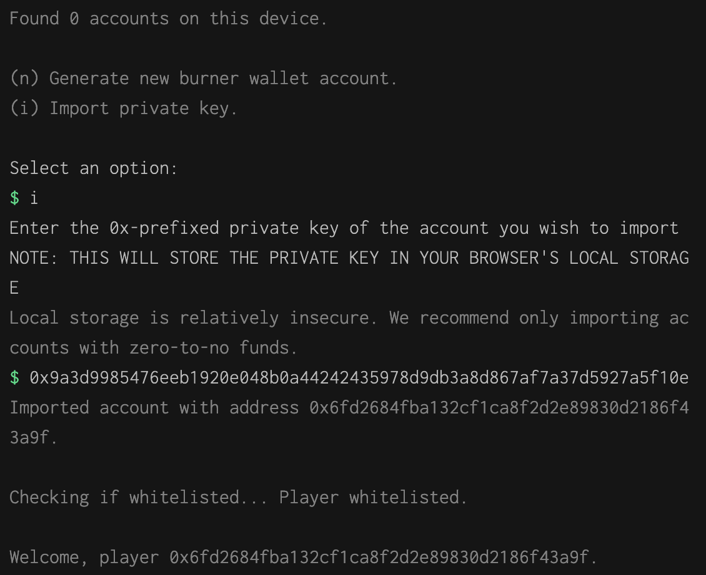
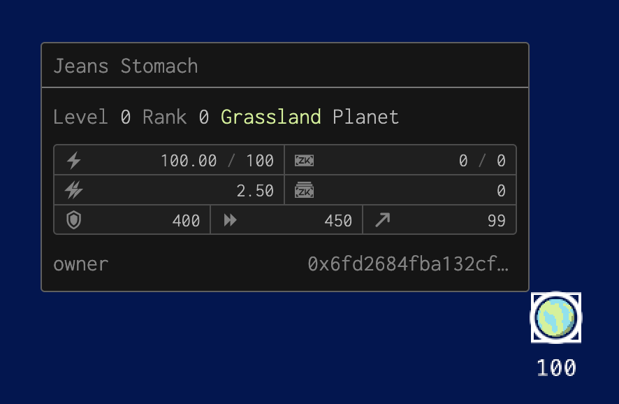

# darkforest-local

The Dark Forest client deploy process is set up for players to easily fork the client and connect to
the maininet game, but that design decision currently makes it difficult to run a playable version
of the game locally. This repository provides a setup for running a local game with just a few
steps.

This repo uses submodules to pair the [Dark Forest Ethereum
backend](https://github.com/darkforest-eth/eth) with the [Dark Forest TypeScript
frontend](https://github.com/darkforest-eth/client) so you can launch a local game.

## Install

- Clone with submodules `git clone --recurse-submodules https://github.com/projectsophon/darkforest-local` or if you've already cloned and want to update
  the module `git submodule update --init --recursive`
- Install [Yarn](https://classic.yarnpkg.com/en/docs/install)
- Run `yarn` at the top level to automatically install all dependencies from subfolders.

## Run a local game

- Open a terminal tab and run `yarn start`, which will 1) start a local node, 2) deploy the contracts, and 3) run the local client in dev mode
- When finsihed, the process should pop up your browser to the game client at http://localhost:8081/

You won't have a webserver to drip you a few cents to start playing (which Dark Forest usually does)
so instead of creating a new burner wallet, you'll want to import one of the private keys the node
funded for you. See the node page where it prints wallets like:

> Account #2: 0x3097403b64fe672467345bf159f4c9c5464bd89e (100 ETH)
>
> Private Key: 0x67195c963ff445314e667112ab22f4a7404bad7f9746564eb409b9bb8c6aed32

## Static deployment of Dark Forest (no webserver)

If you want to deploy the contracts (with whatever modifications you want) to mainnet, and client
code (with whatever modifications you want), you can follow these instructions. The reasons you
might want to do this could be one of:

- you want to run a community round of Dark Forest
- you want to run a multiplayer round with some friends
- etc.

Deploying to production is quite similar to deploying a local version of the game, but I'm going to
walk through the steps explicitly here.

### Step 1: deploy contracts

Unlike in development mode, in production mode you will need to create a `.env` file in both the
`client/` and `eth/` submodules. You can find the set of environment variables you will need to
populate those `.env` files with in their adjacent `.env.example` files.

> Danger! The `.env` files ARE in the respective `.gitignore`s of the aforementioned submodules,
> however you should also manually make sure that they don't end up checked into your repository.

To deploy the contracts, you will need to run the following command:

```bash
yarn workspace eth hardhat:prod deploy
```

You should see something like this:


> Dark Forest uses [yarn workspaces](https://yarnpkg.com/features/workspaces)

To find out more information about the `contracts` submodule, you can look here:
[https://github.com/darkforest-eth/eth](https://github.com/darkforest-eth/eth).

### Step 2: deploy client website

To deploy the website interface, you may either self-host, or use the same infra that we use -
[Netlify](https://www.netlify.com/). This is a simple option, and free for up to some amount of
gigabytes of bandwidth per month, which has often been enough for us.

To deploy to Netlify, you can run the following command:

```bash
yarn workspace client deploy:prod
```

You should see something like this:


### Step 3: allow player addresses

The default implementation of Dark Forest ships with a [whitelist
contract](https://github.com/darkforest-eth/eth/blob/master/contracts/Whitelist.sol). When we
deployed the contracts in Step 1, amongst them was this whitelist contract. A 'static' deployment of
Dark Forest (no web server) isn't capable of submitting a whitelisting transaction on behalf of the
user (which lets a given burner address into the game and drips it a fraction of an xDAI).

This means that if you want to let players into your game, you must first collect their
addresses.

> If you want to generate a burner wallet on the CLI for testing (eg. to make sure that the deployment
> worked) you can do so via the following command, which prints the details of a new randomly
> generated public-private keypair:

> ```bash
> yarn workspace eth hardhat:dev wallet:new
> ```
>
> 

Once you collect the addresses of the people you want to let into your world, you can register them
individually via the following command

```bash
yarn workspace eth hardhat:prod whitelist:register --address $BURNER_WALLET_ADDRESS
# where $BURNER_WALLET_ADDRESS is the network address of the player you want to allow to play in
# your deployment of the game.
```

If everything worked properly, you should be able to log in:



Then, once you've found a home planet, you should be able to enter the game!



## Update to latest Dark Forest code

If theres been new Dark Forest updates released and we haven't yet updated this repo yet, it is possible you can get away with updating yourself by running `git submodule update --remote --merge` and remember to run `yarn` again.

## For maintainers of the repo updating to latest Dark Forest code

- [Update the submodules](#update-to-latest-dark-forest-code).
- Replace the root `yarn.lock` with the `yarn.lock` from `eth/` or `client/`
- Run `yarn`.
- Finally add all changes, commit, and PR.
